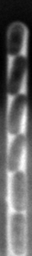
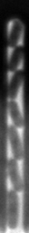
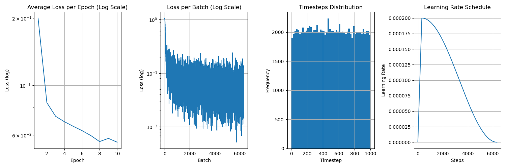

# Diffusion Model for Synthetic Microscopy Data Generation

A PyTorch-based framework for generating synthetic microscopy data of bacterial cells in microfluidic devices using diffusion models. This project specializes in the "mother machine" - a microfluidic device for long-term single-cell observation.

## Results Preview

### Generated Videos
Each video consists of 16 consecutive frames showing synthetic bacterial cell growth:

 &nbsp;&nbsp;&nbsp;&nbsp;  &nbsp;&nbsp;&nbsp;&nbsp;  &nbsp;&nbsp;&nbsp;&nbsp;  &nbsp;&nbsp;&nbsp;&nbsp; 

### Ground Truth Videos
 &nbsp;&nbsp;&nbsp;&nbsp;  &nbsp;&nbsp;&nbsp;&nbsp;  &nbsp;&nbsp;&nbsp;&nbsp;  &nbsp;&nbsp;&nbsp;&nbsp; 

## Features
- Image and video diffusion model training
- Cell Tracking Challenge (CTC) dataset compatibility
- Built on PyTorch and diffusers library
- Pre-trained models available
- Automated dataset management
- Weights & Biases integration for experiment tracking

## Installation

### Prerequisites
- CUDA-capable GPU (recommended)
- Anaconda or Miniconda

### Setup
```bash
conda env create -f env.yaml
conda activate diffusion-env
```

## Dataset

### Using the MOMA Dataset
The default "moma" (Mother Machine) dataset follows the Cell Tracking Challenge (CTC) format and is automatically downloaded from [Zenodo](https://zenodo.org/records/11237127). All images used to train the model are resized to 256x32 pixels.

### Custom Dataset Structure
Support for custom datasets through either:
1. CTC format conversion
2. Custom Dataset class implementation

Example CTC structure:
```
data/
    /moma/
        /CTC/
            train/
                01/
                    t001.tif
                    t002.tif
                02/
                    t001.tif
                    t002.tif
```

## Usage

### Training
Train on images or videos:
```bash
# For video training
python main.py --dataset moma --data-type video

# For image training
python main.py --dataset moma --data-type image
```

### Model Checkpoints
Checkpoints are saved automatically when loss improves:
```
models/
    /moma/
        /video/
            /<modelname>/
                config.json                            # Model hyperparameters and architecture settings
                diffusion_pytorch_models.safetensors   # Trained model weights and states
                training_metrics.png                   # Loss curves, Noise schedule distribution & and learning rate 
                epoch_5/                               # Checkpoint directory for each epoch
                    sample_001.gif                     # Generated validation samples
                    sample_002.gif
                    sample_003.gif
```

### Inference
Generate new samples:
```bash
python inference.py --dataset moma --data-type video
```

Output structure:
```
outputs/
    /moma/
        /video/
            /<modelname>/
                {num_timesteps}_inference_steps_<sample_number>.gif
```

## Model Architecture

### Components
- **VAE Encoder/Decoder**: Uses `AutoencoderKL` for dimensionality reduction
- **Image Model**: `UNet2DModel` for single-frame generation
- **Video Model**: `UNet3DConditionModel` for temporal sequence generation (generates 16-frame sequences)

### Training Progress

| Epoch 1 | Epoch 3 | Epoch 5 | Epoch 7 | Epoch 9 |
|:-:|:-:|:-:|:-:|:-:|
||||||

### Training Metrics


# Future Work
 - Incorporate validation set
 - Generate segmentation masks in addition to images
 - Generate longer videos or with larger image sizes
